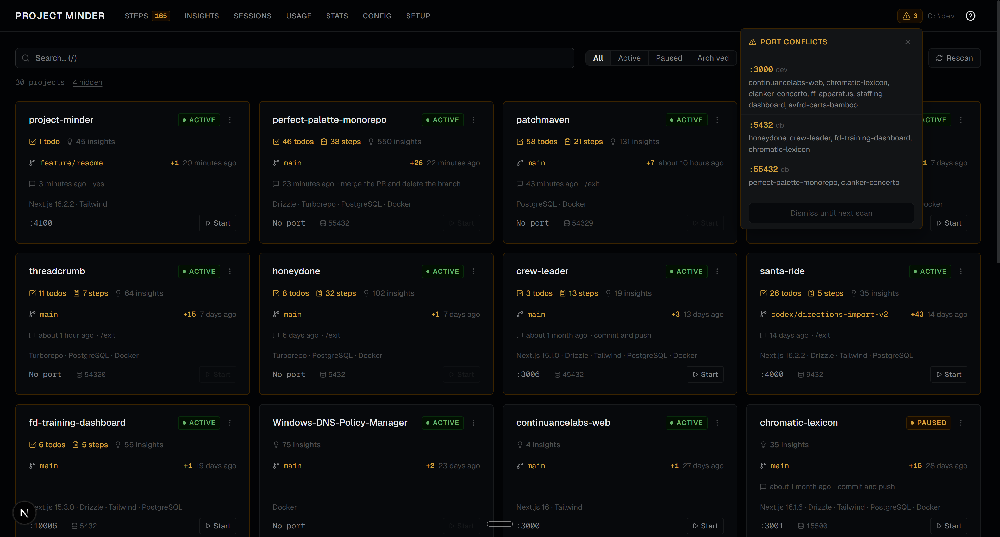

# Project Minder

> A local-only dev dashboard that auto-scans your projects and surfaces the context you need — git status, Claude Code sessions, TODOs, costs, and more — without leaving your browser.


---



---
Check out [https://joshuatownsend.github.io/project-minder/](https://joshuatownsend.github.io/project-minder/) for more info and interface screenshots!
---
## Features

### Dashboard & Scanning
- Auto-scans one or more directories (e.g. `~/dev/*`) and renders every project as a card
- Background git dirty-status checks — amber `+N` indicators appear as results arrive
- Search, filter by status, and sort across all projects
- Per-project status labels (active, paused, archived), hide/unhide, and port overrides
- 5-minute in-memory scan cache; force-rescan anytime from the UI

### Claude Code Integration
- **Live session status** — dashboard cards show a green "coding" or amber "waiting on you" badge when a Claude session is active; status is inferred from the JSONL tail (tool_use/tool_result pairing + file mtime) and refreshes automatically every 15 seconds
- **Sessions browser** — browse every Claude Code session with full-text content search (matches message body, not just metadata), duration, token counts, and highlighted match snippets; auto-refreshes without a manual reload
- **Session detail** — full timeline with fenced code block and inline `code` rendering, tool usage, file operations, and subagent tracking per session
- **Session recaps** — surfaces `/recap` summaries as the primary session label with an amber badge
- **Insights extraction** — scrapes `★ Insight` blocks from conversation history into per-project `INSIGHTS.md` files; cross-project browser with full-text search
- **Token cost analytics** — `/usage` page with time-period filters, per-model/project/category breakdowns, daily cost trend chart, and CSV/JSON export; worktree sessions are merged into their parent project in the By Project chart

### Project Management
- **TODO tracking** — reads each project's `TODO.md`; add items inline or via a cross-project Quick Add modal (Shift+T)
- **Manual Steps tracker** — surfaces `MANUAL_STEPS.md` entries across all projects; interactive checkboxes toggle steps on disk; file watcher fires toast + OS notifications when Claude adds new steps mid-session
- **Worktree overlay** — TODOs, Manual Steps, and Insights from active Claude Code worktrees appear in collapsible sections on detail pages; card badges aggregate main + worktree counts

### Observability & Stats
- **Stats dashboard** — portfolio-wide overview: tech stack distribution, project health, Claude Code usage (tokens, tools, models)
- **Usage dashboard** — 13-category activity classification, one-shot success rate detection, shell command and MCP server frequency breakdowns
- **Dev server control** — start, stop, and restart managed dev servers from the UI; view live stdout/stderr output

### Setup Tools
- **Setup guide** — `/setup` page with copy-paste CLAUDE.md instruction blocks and optional Claude Code `PreToolUse` hooks
- **Auto-apply** — apply setup steps directly to any managed project from the UI; idempotent (existing blocks are skipped, files backed up to `.minder-bak`)

---

## Quick Start

**Prerequisites:** Node.js ≥ 20.19 — runs on macOS, Linux, and Windows

```bash
git clone https://github.com/joshuatownsend/project-minder.git
cd project-minder
npm install
```

Configure your scan root(s) in `.minder.json` in the Project Minder repo root — the same directory where you run `npm run dev` (create it if it doesn't exist):

```json
{
  "devRoots": ["/home/you/dev"]
}
```

On Windows use `C:\\dev` (or whatever your dev root is).

Then start the dev server:

```bash
npm run dev
# Open http://localhost:4100
```

---

## Configuration

All settings live in `.minder.json` at the repo root. The in-app **Config page** (`/config`) provides a full UI for most of these.

| Key | Type | Description |
|-----|------|-------------|
| `devRoots` | `string[]` | Directories to scan. First entry is the primary root. |
| `devRoot` | `string` | Legacy single-root fallback. Kept in sync automatically. |
| `statuses` | `Record<string, "active" \| "paused" \| "archived">` | Per-project status labels. |
| `hidden` | `string[]` | Project slugs hidden from the dashboard. |
| `portOverrides` | `Record<string, number>` | Override the detected dev port for a project. |

---

## How It Works

Project Minder is a Next.js app that runs entirely on your local machine — no database, no cloud sync. On each dashboard load it scans your configured directories in parallel batches, running 9 scanner modules per project (package.json, git, Claude sessions, TODOs, manual steps, insights, and more). Results are cached in memory for 5 minutes. A background worker checks git dirty status in rolling batches of 3 repos, and the dashboard polls for results as they arrive.

The process manager spawns dev servers as child processes using project-local binaries and stores the last 200 lines of output per process. On Windows it uses `taskkill /F /T` for clean process-tree teardown; on macOS/Linux it sends `SIGTERM` to the process group.

---

## Inspired By

- [CodeBurn](https://github.com/AgentSeal/codeburn) — token cost analytics design
- [Sniffly](https://github.com/chiphuyen/sniffly) — stats dashboard concept
- [claude-code-karma](https://github.com/JayantDevkar/claude-code-karma) — sessions browser concept
- [c9watch](https://github.com/minchenlee/c9watch) — live session status monitoring concept
- [raphi011's insights gist](https://gist.github.com/raphi011/dc96edf80b0db8584527fefc6a3b4bd0) — insights extraction concept

---

## License

MIT © Josh Townsend
